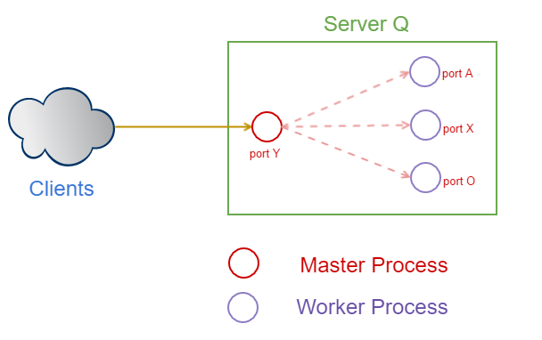

# Cluster Module for Scaling

The *cluster module* facilitates distributing the load of an application across several instances of the application running on the same machine

### Master and Worker Processes

The *master* process is responsible for 

* spawning *worker* processes
* distributing incoming requests to *worker* processes

### Load Balancing Strategies

*Version 0.11.2*

The *master* process includes a *round robin load-balancing algorithm* to distribute the incoming requests evenly across all the workers. 

