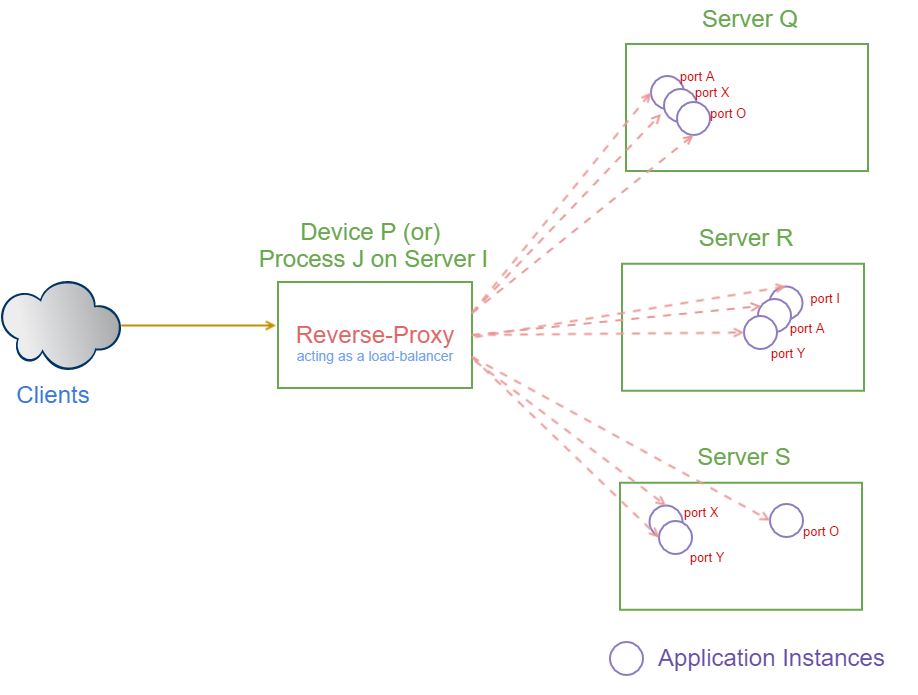

# Using Reverse Proxy for Scaling

A *reverse proxy* is a device or a service placed between the clients and the application instances, which serves the following purpose

* accepts any requests from the clients
* forwards the requests to the destination servers, which are application instances
* returns the results from the servers to the clients

**Clients**

The clients communicate with the *reverse proxy*, which acts as a single point of access to one or more standalone application instances running on one or multiple machines.

**Application Instances**

The application instances are standalone instances of the same application which can be 

* *Multi-process*: application instances running on different ports of the same machine and/or
* *Multi-machine*: application instances running on different machines (on one or multiple ports on multiple machines)

### Reverse Proxy vs Load Balancer - Similarities

As the *reverse-proxy* redirects client requests to application instances, it acts a *load balancer* distributing the incoming requests to various application instances.

